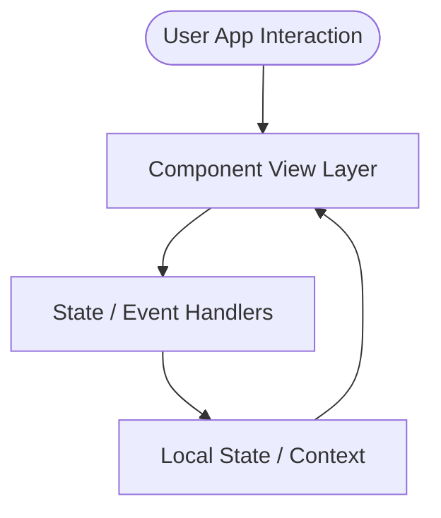

# 🚀 Ufuq-Real-Estate-React

   

## 📌 Description
A professional codebase representing high-performance development practices, clean folder organization, and solid implementation standards. 

## 🛠️ Technology Stack

| Tech | Purpose |
| :--- | :--- |
| React.js | View layer component rendering |

## 🧬 Architecture & Logic Flow
Below is a conceptual visualization of the components and data rendering logic in this project.



## 📂 Folder Structure
```text
Ufuq-Real-Estate-React/
├── [object Object]
├── [object Object]
├── [object Object]
├── [object Object]
├── [object Object]
├── [object Object]
```

## 🚀 Getting Started

### Prerequisites
- Node.js >= 20 (Required for build/server environments)
- Modern Web Browser (Chrome, Edge, Firefox)

### Setup & Launch
1. Clone the repository:
   ```bash
   git clone https://github.com/Sayed-Herzallah/Ufuq-Real-Estate-React.git
   ```
2. Navigate to folder:
   ```bash
   cd Ufuq-Real-Estate-React
   ```
3. Setup Environment:
   ```bash
   npm install
   ```
4. Run Locally:
   ```bash
   npm start
   ```

---
## 👨‍💻 Developed By
**Sayed Herzallah**  
*Backend-Focused Full-Stack Developer*  
[LinkedIn Profile](https://www.linkedin.com/in/sayed-herzallah) | [Portfolio](https://herzallah.me)
