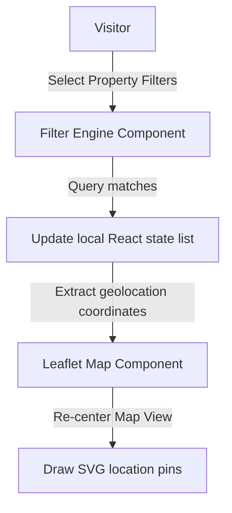

# Ufuq Real Estate Portal: Premium Commercial Properties Directory

<div align="center">
  
</div>

<div align="center">
     
</div>

بوابة **أفق العقارية** هي واجهة مستخدم تفاعلية متكاملة في React لاستعراض وتصفية العقارات السكنية والتجارية، مدمجة بخرائط Leaflet التفاعلية وتصميمات شبكية مرنة لتسهيل إيجاد العقارات المناسبة.

This repository holds the React frontend client and property search interface for the **Ufuq Real Estate Platform**. Featuring Leaflet map integrations, search criteria logic, and premium CSS grids.

---

## 🧬 Property Search & Map Flow

The application updates maps coordinates dynamically upon criteria changes:



---

## 🧬 Key Layout Features

1.  **Dynamic Filtering Engine**: Multi-criteria filters allowing instant property matches.
2.  **Leaflet Geolocation Pins**: Interactive map rendering pins corresponding to listings coordinates.
3.  **Property Specs Grid**: Modern layout cards presenting price metrics, sizing metrics, and pictures.

---

## 🛠️ Technology Stack & Styling Assets

*   **Frontend Library**: **React 18** + **Vite**.
*   **Maps Integration**: **Leaflet** maps + OpenStreetMap API.
*   **Styling Engine**: **TailwindCSS** + CSS variables.

---

## 📂 Repository Module Layout

```text
ufuq-real-estate-react/
├── src/
│   ├── components/      # PropertyCard, MapWidget, FilterBar
│   ├── styles/          # Tailwind stylesheet configs
│   ├── App.jsx          # Main client interface
│   └── main.jsx         # Render entry point
├── package.json         # Node metadata
└── README.md            # System documentation
```

---

## ⚡ Local Setup & Run
```bash
git clone https://github.com/Sayed-Herzallah/ufuq-real-estate-react.git
cd ufuq-real-estate-react
npm install
npm run dev
```

---

## 📄 License
Licensed under the **MIT License**.
